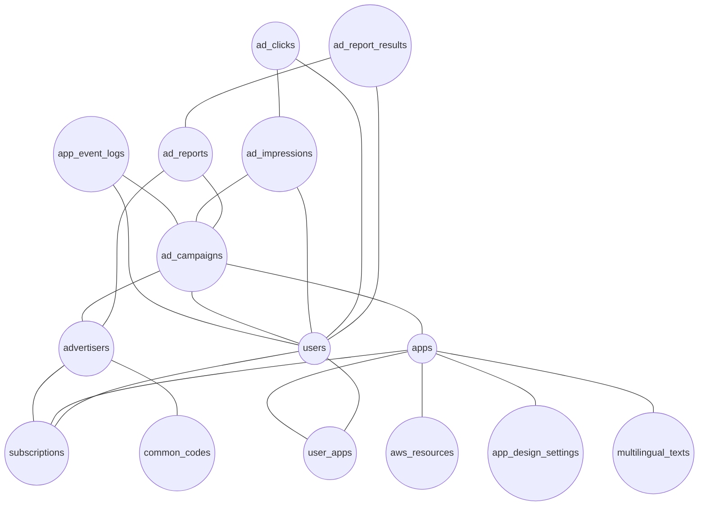

```mermaid
graph TD
    users((users))
    apps((apps))
    app_event_logs((app_event_logs))
    ad_campaigns((ad_campaigns))
    advertisers((advertisers))
    ad_impressions((ad_impressions))
    subscriptions((subscriptions))
    common_codes((common_codes))
    aws_resources((aws_resources))
    app_design_settings((app_design_settings))
    user_apps((user_apps))
    multilingual_texts((multilingual_texts))
    ad_clicks((ad_clicks))
    ad_reports((ad_reports))
    ad_report_results((ad_report_results))

    app_event_logs --- users
    app_event_logs --- ad_campaigns
    ad_campaigns --- advertisers
    ad_campaigns --- users
    ad_campaigns --- apps
    ad_impressions --- ad_campaigns
    ad_impressions --- users
    advertisers --- subscriptions
    advertisers --- common_codes
    apps --- subscriptions
    apps --- aws_resources
    apps --- app_design_settings
    apps --- user_apps
    apps --- multilingual_texts
    users --- user_apps
    users --- subscriptions
    ad_clicks --- ad_impressions
    ad_clicks --- users
    ad_reports --- advertisers
    ad_reports --- ad_campaigns
    ad_report_results --- ad_reports
    ad_report_results --- users
``` 