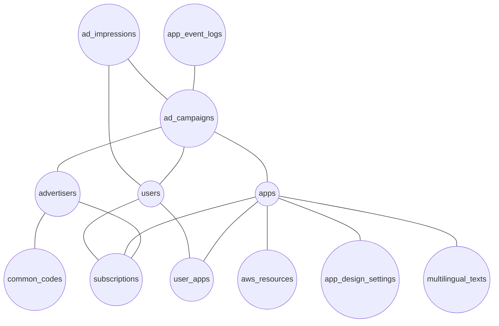

# 📊 UniBase DB ERD 문서 (v1.1 확장 버전)

## 개요
이 문서는 UniBase 플랫폼의 데이터베이스 엔티티 관계도(ERD)를 설명합니다. v1.1 확장 버전에서는 광고, 관리자 시스템, 사용자 활동 로그, AWS 리소스 관리 등의 새로운 기능을 지원하는 테이블 구조가 추가되었습니다.

## ERD 다이어그램

## 주요 엔티티 그룹

### 1. 핵심 엔티티
- `users`: 사용자 계정 정보
- `apps`: 플랫폼에 등록된 앱 정보
- `user_apps`: 사용자와 앱 간의 매핑
- `subscriptions`: 구독 정보

### 2. 광고 시스템 엔티티
- `advertisers`: 광고주 정보
- `ad_campaigns`: 광고 캠페인 정보
- `ad_impressions`: 광고 노출 기록

### 3. 로깅 및 모니터링 엔티티
- `app_event_logs`: 앱 내 이벤트 로그
- `app_design_settings`: 앱 디자인 설정

### 4. 인프라 관리 엔티티
- `aws_resources`: AWS 리소스 정보

### 5. 유틸리티 엔티티
- `common_codes`: 공통 코드 정보
- `multilingual_texts`: 다국어 텍스트

## 주요 관계

### 앱 중심 관계
- `apps`는 플랫폼의 중심 엔티티로 다수의 다른 엔티티와 연결됩니다.
- 사용자는 `user_apps`를 통해 여러 앱과 연결됩니다.
- 앱은 `app_design_settings`를 통해 UI/UX 설정을 관리합니다.
- 앱은 `aws_resources`와 연결되어 필요한 클라우드 리소스를 관리합니다.

### 광고 시스템 관계
- `advertisers`는 `ad_campaigns`와 1:N 관계를 가집니다.
- `ad_campaigns`는 `ad_impressions`와 1:N 관계를 가집니다.
- `ad_campaigns`는 특정 `apps`에 연결됩니다.
- `ad_impressions`는 `users`와 연결되어 어떤 사용자에게 광고가 노출되었는지 추적합니다.

### 구독 및 로깅 관계
- `subscriptions`는 `advertisers`, `apps`, `users` 간의 지불 관계를 관리합니다.
- `app_event_logs`는 `ad_campaigns`와 연결되어 광고 관련 이벤트를 추적합니다.

## 확장 테이블 문서
각 확장 테이블 그룹에 대한 상세 문서는 다음 링크에서 확인할 수 있습니다:

- [광고 추적 테이블 설계](./schema_v1.1_ads.md)
- [관리자 시스템 테이블 설계](./schema_v1.1_admin.md)
- [사용자 활동 로그 테이블 설계](./schema_v1.1_logs.md)
- [AWS 리소스 관리 테이블 설계](./schema_v1.1_aws.md)

## 참고 사항
- 이 ERD는 실제 데이터베이스 구현 시 참고용으로 사용됩니다.
- 실제 구현에서는 인덱스, 제약조건 등 추가적인 최적화가 필요할 수 있습니다.
- DB 테이블명과 칼럼명은 각 모듈별 구현 시 약간의 변경이 있을 수 있습니다. 